# Flutter Reactive

Goodbye repetitive setState() calls! Welcome to Flutter Reactive.
No ChangeNotifier, no boilerplate — just Reactive values bound to States.



## Why Flutter Reactive ?

Let's be honest… writing `setState()` everywhere in 2026 feels old and most Flutter state management solutions are either too verbose (👀 ChangeNotifier, Provider…), too abstract (Riverpod, Bloc…), or come with too much features (Getx...).

**Flutter Reactive** takes a different approach:\
**Keep things simple, direct, and predictable.**

No unnecessary concepts, no boilerplate, no steep learning curve.
Flutter Reactive has **_zero_** external dependencies — just a plain Dart object that propagates its own changes. No context, no codegen, no framework lock-in.

## Comparison

| Specifications                    | Flutter Reactive | GetX | Provider | Bloc |
| --------------------------------- | ---------------- | ---- | -------- | ---- |
| Minimal boilerplate ?             | ✅               | ✅   | ❌       | ❌   |
| Easy to learn ?                   | ✅               | ✅   | ✅       | ❌   |
| Built-in reactivity (no setup) ?  | ✅               | ❌   | ❌       | ❌   |
| Automatic UI updates ?            | ✅               | ✅   | ❌       | ✅   |
| No external dependency required ? | ✅               | ❌   | ❌       | ❌   |
| Good for small apps ?             | ✅               | ✅   | ✅       | ❌   |
| Good for large apps ?             | ✅               | ❌   | ✅       | ✅   |
| Supports computed values easily ? | ✅               | ❌   | ❌       | ❌   |
| Supports side effects cleanly ?   | ✅               | ❌   | ❌       | ❌   |
| Transaction / rollback system ?   | ✅               | ❌   | ❌       | ❌   |
| Stream-friendly ?                 | ✅               | ✅   | ❌       | ✅   |
| No strict architecture required ? | ✅               | ✅   | ✅       | ❌   |
| Full control over state changes ? | ✅               | ❌   | ❌       | ❌   |

## Features

- `Reactive<T>` and nullable `ReactiveN<T>`
- Strict/non-strict update mode
- `listen`, `unlisten`, `stream`, `notify`
- `bind` / `unbind` to Flutter `State`
- `ReactiveBuilder`, `ReactiveStateBuilder`
- Validators with `require(...)`
- Derived state with `as`, `combine`, `combine2..combine5`, `compute`
- Transactions with optional rollback: `Reactive.run(...)`
- Save/restore checkpoints: `save`, `restore`, `unsave`, `unsaveAll`
- Utility methods: `debounce`, `throttle`, `when`, `setAsync`, `mutate`
- Extensions for `num`, `bool`, `String`, `Iterable/List`, `Map`, and `State`

## Installation

```bash
dart pub add flutter_reactive
```

or manually add in your `pubspec.yaml`

```yaml
dependencies:
  flutter_reactive: ^1.0.0
```

then

```dart
import 'package:flutter_reactive/flutter_reactive.dart';
```

## Quick Start

_🚨 If you come from `0.x` versions, [see breaking changes here](#breaking-changes-in-100)._

We recommend to prefix all reactive variable names with a lowercase `r` to make them instantly recognizable in your codebase.

```dart
final rCounter = Reactive(0);         // strict mode (default)
final rUser = ReactiveN<String>();    // nullable
final rCount2 = 0.reactive();         // extension helper
final rLoose = 0.reactive(false);     // non-strict: same value still notifies

rCounter.value = 1;
rCounter.set(2);
rCounter.update((v) => v + 1);
await rCounter.setAsync(Future.value(10));
```

## Using Inside a State

```dart
class _MyPageState extends State<MyPage> {
  late final rCounter = react(0);      // auto-binds to this State
  late final rName = reactN<String>(); // nullable + auto-bind

  @override
  Widget build(BuildContext context) {
    return Text('Counter: ${rCounter.value}');
  }
}
```

You can also bind manually:

```dart
final rCounter = Reactive(0);

@override
void initState() {
  super.initState();
  rCounter.bind(this);
}

@override
void dispose() {
  rCounter.unbind(this);
  super.dispose();
}
```

## Listeners and Streams

```dart
void onCounterChanged(int value) {
  debugPrint('Counter changed: $value');
}

rCounter.listen(onCounterChanged);
rCounter.listen(onCounterChanged, true); // emitInitial
rCounter.unlisten(onCounterChanged);

rCounter.stream.listen((value) {
  debugPrint('Stream value: $value');
});

// or inside a stream builder
StreamBuilder<int>(
  stream: rCounter.stream,
  builder: (context, snapshot) =>
      Text(snapshot.data?.toString() ?? ''),
);
```

## Widgets

### ReactiveBuilder

Build a widget either by automatically tracking reactive reads, or by
watching a specific reactive value.

- `ReactiveBuilder(() { ... })` automatically tracks every reactive read inside the builder
- `ReactiveBuilder.watch(reactive, builder)` listens to one explicit reactive
- `ReactiveBuilder.watch2..watch5(...)` provide typed builders for multiple explicit reactives

```dart
ReactiveBuilder(() {
  return Text('Count: ${rCounter.value}');
});

ReactiveBuilder.watch(
  rCounter,
  (value) => Text('Count: $value'),
);

ReactiveBuilder.watch2(
  rPrice,
  rQty,
  (price, qty) => Text('Total: ${price * qty}'),
);

// Equivalent helper on Reactive<T>
rCounter.build((value) => Text('Count: $value'));
```

### ReactiveStateBuilder

```dart
ReactiveStateBuilder<bool>(
  initialState: false,
  states: {
    true: (reactive) => ElevatedButton(
      onPressed: () => reactive.value = false,
      child: const Text('Disable'),
    ),
    false: (reactive) => ElevatedButton(
      onPressed: () => reactive.value = true,
      child: const Text('Enable'),
    ),
  },
);
```

## Validation

```dart
final rCounter = 0
    .reactive()
    .require((v) => v >= 0, 'Counter cannot be negative')
    .require((v) => v <= 10, 'Counter must be <= 10');

try {
  rCounter.value = 11;
} on ReactiveValidatorError catch (e) {
  debugPrint('message: ${e.message}');
  debugPrint('invalid value: ${e.value}');
}
```

## Derived State

### `as(...)` (single source)

```dart
final rText = ''.reactive();
final rLength = rText.as((text) => text.length);
```

### `combine(...)` and `combine2..combine5`

```dart
final rA = 1.reactive();
final rB = 2.reactive();

final rSum = Reactive.combine2(rA, rB, (a, b) => a + b);
// or:
final rSum2 = Reactive.combine([rA, rB], (values) => values[0] + values[1]);
```

### `compute(...)` (auto dependency tracking)

```dart
final rPrice = 100.reactive();
final rQty = 2.reactive();

final rTotal = Reactive.compute(() => rPrice.value * rQty.value);
```

`compute` and `combine*` outputs are read-only (derived values).
If you are migrating from an older version, `Reactive.computed(...)`
becomes `Reactive.compute(...)`.

## Transactions and Rollback

```dart
final rCounter = 0.reactive().require((v) => v >= 0, 'Must stay >= 0');

await Reactive.run(() {
  rCounter.inc(5);
  rCounter.dec(2);
});
```

Rollback is enabled by default when an error happens:

```dart
await Reactive.run(
  () {
    rCounter.inc(5);
    rCounter.dec(10); // fails validator, changes are rolled back
  },
  onError: (error) => debugPrint(error.toString()),
);
```

Manual rollback:

```dart
final tx = await Reactive.run(
  () {
    rCounter.inc(5);
    rCounter.dec(10);
  },
  rollbackOnError: false,
);

tx.rollback();
```

## Save and Restore State

```dart
final rName = ''.reactive();

rName.value = 'Andy';
rName.save('step1');

rName.value = 'Max';
rName.restore('step1'); // Andy

rName.unsave('step1');
rName.unsaveAll();
```

## Side-Effect Helpers

```dart
rCounter.when((v) => v == 0, (_) => debugPrint('Counter is zero'));

rCounter.debounce(300, (value) {
  debugPrint('Debounced: $value');
});

rCounter.throttle(300, (value) {
  debugPrint('Throttled: $value');
});
```

## Core Extensions (Exported by Default)

### `Reactive<bool>`

- `toggle()`, `enable()`, `disable()`
- `isTrue`, `isFalse`

### `Reactive<num>`

- `increment()`, `decrement()`, `inc()`, `dec()`
- `isZero`, `isPositive`, `isNegative`
- `clamp(min, max)`, `roundTo(digits)`
- arithmetic/comparison operators (`+`, `-`, `*`, `/`, `~/`, `%`, unary `-`, `<`, `<=`, `>`, `>=`)

### `Reactive<String>`

- `isEmpty`, `isNotEmpty`, `length`
- `clear()`, `append()`, `prepend()`, `trim()`, `toUpper()`, `toLower()`
- `upper`, `lower`, `trimmed`
- `contains`, `startsWith`, `endsWith`
- operators: `+`, `<`, `<=`, `>`, `>=`

### `Reactive<Iterable<T>>` and `Reactive<List<T>>`

`Iterable` helpers:

- `first`, `firstOrNull`, `last`, `lastOrNull`
- `isEmpty`, `isNotEmpty`, `length`
- `toList()`, `forEach(...)`, `where(...)`, `firstWhereOrNull(...)`
- `transform(...)`, `at(index)`, `atOrNull(index)`
- read operator `[]`

`List` helpers:

- `add`, `addFirst`, `addAll`, `addToSet`
- `remove`, `removeWhere`, `removeAll`, `clear`, `sort`
- read/write operators `[]` and `[]=`

### `Reactive<Map<K, V>>`

- `put`, `remove`, `clear`, `has`, `get`, `forEach`
- `keys`, `values`, `entries`
- read/write operators `[]` and `[]=`

### `State` extension

- `updateState([callback])`
- `react(initial, [strict])`
- `reactN([initial, strict])`

## Optional Extra Extensions (Direct Import)

These files exist but are not exported by `flutter_reactive.dart`.
Import them directly if needed:

```dart
import 'package:flutter_reactive/extensions/datetime.dart';
import 'package:flutter_reactive/extensions/duration.dart';
import 'package:flutter_reactive/extensions/color.dart';
```

They provide helpers for `Reactive<DateTime>`, `Reactive<Duration>`, and `Reactive<Color>`.

## Best Practices

- Prefer immutable updates when possible; use `mutate(...)` only for in-place mutation.
- Use strict mode (`strict = true`) for predictable change detection.
- Use non-strict mode (`strict = false`) when same-value notifications are required.
- Dispose long-lived reactives you no longer need: `reactive.dispose()`.

## Breaking Changes in 1.0.0

- `ReactiveBuilder(reactive: ..., builder: ...)` is no longer the main API
- `Reactive.computed(...)` is now `Reactive.compute(...)`
- `listen(callback)` now also supports `listen(callback, true)` to emit immediately
- `extensions/list.dart` is now `extensions/iterable.dart`

## Migration from 0.x

### `ReactiveBuilder`

Before:

```dart
ReactiveBuilder<int>(
  reactive: rCounter,
  builder: (value) => Text('$value'),
);

ReactiveBuilder.compute(() {
  return Text('${rCounter.value}');
});
```

Now:

```dart
ReactiveBuilder.watch(
  rCounter,
  (value) => Text('$value'),
);

ReactiveBuilder(() {
  return Text('${rCounter.value}');
});
```

### `computed(...)` to `compute(...)`

Before:

```dart
final total = Reactive.computed(() => price.value * qty.value);
```

Now:

```dart
final total = Reactive.compute(() => price.value * qty.value);
```

### `listen(...)`

Before:

```dart
rCounter.listen(onCounterChanged);
```

Now:

```dart
rCounter.listen(onCounterChanged);
rCounter.listen(onCounterChanged, true); // emit current value immediately
```

### `list.dart`

Before:

```dart
import 'package:flutter_reactive/extensions/list.dart';
```

Now:

```dart
import 'package:flutter_reactive/extensions/iterable.dart';
```

## License

MIT. See [LICENSE](LICENSE).
